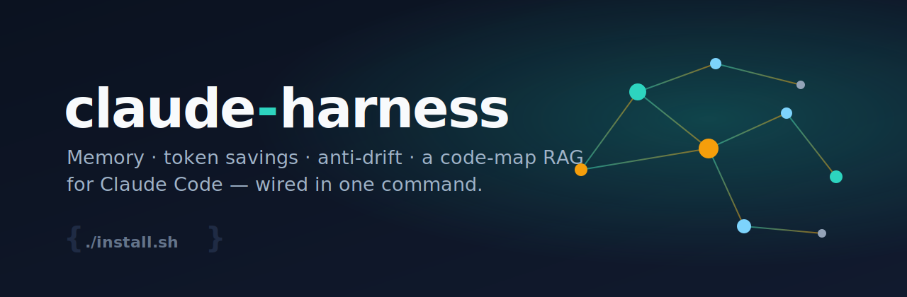

<p align="center">
  
</p>

<h1 align="center">awesome-harness</h1>

<p align="center">
  <b>A drop-in harness that makes Claude Code cheaper, sharper, and forgetful-proof.</b><br>
  Persistent memory · token savings · anti-drift · a code-map RAG · disciplined cheap-model coding — wired in one command.
</p>

---

## Why this exists

If you run Claude Code seriously you hit the same three walls:

1. **Token burn.** Big `CLAUDE.md`s, MCP tool schemas, and ANSI-noisy tool output get re-billed on every turn. Plans evaporate.
2. **Amnesia.** Each session starts cold. Decisions, conventions, and hard-won failures are re-learned (and re-paid for) every time.
3. **Drift.** Long sessions wander off the actual goal — agents quietly start doing something adjacent and forget what you were building.

`awesome-harness` is the set of hooks, skills, and small tools that fix all three, plus a few things that just make the agents *better* (lazy-by-default coding, a code-map to query instead of grepping, deterministic gates). It's the result of a lot of iteration on real multi-repo projects — packaged so you can install it in a minute.

Everything runs **locally**. The one optional network component (a compression proxy) only ever talks to `api.anthropic.com` — the same place your requests already go.

## Install

```bash
git clone https://github.com/<you>/awesome-harness && cd awesome-harness
./install.sh           # copies harness into ~/.claude, safely merges settings.json (backup first)
./install.sh --proxy   # also enable the local token-saving proxy (macOS)
# then, per project you want the full treatment on:
./install-repo.sh /path/to/your/repo
```

Re-running is safe (idempotent). `--dry-run` shows changes without touching anything. **Restart Claude Code afterward** — env vars and tool-search load at process start.

## What you get

### 🧠 Memory that persists across sessions
| Piece | What it does |
|---|---|
| **memgraph** | An FTS index + link graph over your markdown memory. A `recall` hook injects the 1–3 most relevant records into every substantive turn — so the agent starts *warm*, not cold. |
| **mulch** *(dep)* | Per-repo decision/convention/failure memory. `ml prime` at session start, `ml sync` at compact. Wired automatically per repo. |
| **scaffold-ledger** | Captures the *approach* that worked for a task-category on a verified pass, and **promotes-on-beat** (keeps the version that passed in fewer iterations). Next time, recall feeds it back. verify → capture → recall → beat → replace. |

### 💸 Token savings
| Piece | What it does |
|---|---|
| **ctxproxy** *(opt-in)* | A local, **lossless** proxy that strips terminal ANSI/escape noise from tool results before they're billed. Never touches `Read` output (so edits still match), forwards unchanged bytes verbatim (cache-safe), fail-open. |
| **tool-search** | Turns on MCP tool-schema deferral so dozens of MCP tools aren't loaded into every prefix. |
| **router slimming + cache discipline** | Conventions + a length cap that keep `CLAUDE.md`/`AGENTS.md` as routers, not encyclopedias, and keep the prompt-cache prefix stable (where ~90% of the savings live). |
| **autocompact @ 60%** | Compacts earlier so you spend fewer tokens carrying a bloated window. |

### 🎯 Anti-drift
| Piece | What it does |
|---|---|
| **north star** | A repo-root `.northstar.md` (OBJECTIVE / DONE_WHEN / NOT_NOW) re-injected **every turn**. If a task isn't serving the objective, the agent is told to stop and flag it. This is the single biggest fix for "the agent forgot what we were doing." |
| **north-star protection** | A `PreToolUse` gate (`northstar-protect.py`) that makes `.northstar.md` **read-only to the agent** — Write/Edit and the Bash bypasses (`>`, `sed -i`, `tee`, `chmod`…) are denied. A drifting agent can't silence its own alarm by softening the goal; only you edit it, by hand. |
| **PreCompact handoff** | `precompact-handoff.py` — before every compaction a cheap model reads the transcript-slice-since-last-handoff and writes a fixed 7-field handoff (objective / decisions / open-questions / constraints+traps / files+commands / next-step / sources), re-injected on the next session start. Uses a **monotonic ratchet**: inherited constraints are trusted-carry, deleted only on positive contradiction — so negative decisions ("we decided NOT to X") don't silently evaporate across compactions. |
| **irreversible-ops pause** | `irreversible-pause.py` — a denylist-only `PreToolUse` Bash gate that hard-stops `rm -rf`, `git push --force`, and destructive SQL (`DROP`/`TRUNCATE`), with an explicit `CLAUDE_ALLOW_IRREVERSIBLE=1` re-arm. Tight by design (no cry-wolf). |
| **caveman discipline** | Terse intermediate output, one complete final message per turn — you read the summary, not the play-by-play, and pay for fewer tokens in between. |

### 🛠️ Better code from cheaper models
| Piece | What it does |
|---|---|
| **code-decompose** | The orchestration pattern: a decomposer turns a change into tiny verifiable specs (CONTEXT/CHANGE/GOAL/VERIFY) → cheap coder subagents execute one each → a rotating non-builder auditor checks each against its spec. The expensive model thinks once; cheap models do the volume. |
| **ponytail** *(dep)* | A "lazy senior dev" discipline: YAGNI, stdlib/native first, shortest working diff, leave one runnable check. Fewer lines, fewer 3am pages. |
| **BUILDER_STANDARD.md** | A <40-line correctness/boundary ruleset to prepend to any coder prompt: validate input at trust boundaries, no swallowed errors, smallest change, leave a regression check. |
| **check-all** | An opt-in deterministic commit gate (typecheck/lint/test/file-size/TODO/dup) so "done" is objective, not vibes. |

### 🔁 A harness that improves itself
| Piece | What it does |
|---|---|
| **harness-coach** | A weekly, **propose-only** self-audit. A deterministic Python miner reads the last 7 days of your session transcripts (fast — byte-stats over everything, deep-parse only the biggest sessions), computes where you waste tokens (re-read churn, oversized tool results, runaway subagent fan-out, error/rework rates), then hands a compact digest **plus a snapshot of your current harness** to a strong model. It returns a ranked report — each finding tagged `[NEW]`, `[IMPROVE <existing file>]`, or `[ALREADY-COVERED-BY <x>]` with a concrete diff — to `~/Downloads/harness-coach/DATE.md`. It **never edits your harness**; you decide what to apply. Schedule it with the launchd template (`templates/com.awesomeharness.harness-coach.plist`) or any cron. |
| **drift-replay** | A one-shot measurement tool: replay a past transcript through a candidate LLM drift-judge and measure its false-positive rate *before* you wire it live. (In practice it showed a history-anchored judge cries wolf ~90% of the time while the deterministic north-star injection already captures the value — so we *didn't* build the expensive layer. Instrument before you build.) |

### 🗺️ A code-map RAG (query instead of grep)
| Piece | What it does |
|---|---|
| **graphify** *(dep)* | Builds a queryable graph of your code **and** docs (`graphify-out/graph.json`) plus a human-readable wiki (`GRAPH_REPORT.md`). Agents run `graphify query/explain/path` to get a scoped subgraph with `file:line` anchors instead of reading whole files. |
| **auto-refresh** | A niced, non-blocking, self-locking `post-commit` hook keeps the graph current on every commit — no daemon, CPU-safe. |
| **graphify-blast** | Maps a `git diff` → impacted symbols, so a coder sees the blast radius *before* editing. |

## How it works (two layers)

- **Global layer** (`~/.claude/`): the hooks, skills, and tools. Most hooks are **dormant** until a repo opts in.
- **Per-repo markers**: `install-repo.sh` drops a `.northstar.md`, a code-map, the auto-refresh hook, and mulch wiring. That's what activates the global hooks for that repo.

So the global install is harmless everywhere, and each repo gets the full treatment only when you ask.

## Dependencies

The harness wires these together; install the ones you want (the installer detects what's missing and degrades gracefully):

| Tool | Purpose | Install |
|---|---|---|
| `python3`, `git` | core | preinstalled on most systems |
| **graphify** | code-map RAG | `uv tool install graphifyy` |
| **mulch** (`ml`) | per-repo memory | `npm i -g @mulch/cli` (needs `~/.bun/bin` on PATH) |
| **ponytail** | lazy-coding discipline | Claude Code plugin: `DietrichGebert/ponytail` |
| codex / glm / kimi / gemini | non-Claude builder/auditor subagents (optional) | each vendor's CLI |

## Safety & privacy

- Nothing is uploaded. The optional proxy talks only to Anthropic.
- `install.sh` **backs up** your `settings.json` before merging and only adds entries that are missing (idempotent).
- The proxy is **opt-in** and fail-open; it never sets a third-party endpoint.
- Machine-local memory (`tools/memgraph/out/`, `scaffolds/`) is gitignored — your notes never get committed here.

## Related

- **[youtube-research](https://github.com/roarista/youtube-research)** — a zero-install YouTube/social intelligence CLI (transcripts, credible-creator discovery, comment mining) that ships a Claude Code skill so your agents can pull expert, up-to-date knowledge straight from video.

## Status & contributing

This is actively used and will keep evolving. PRs and issues welcome — especially new gates, new memory backends, and Linux parity for the proxy. MIT licensed.
